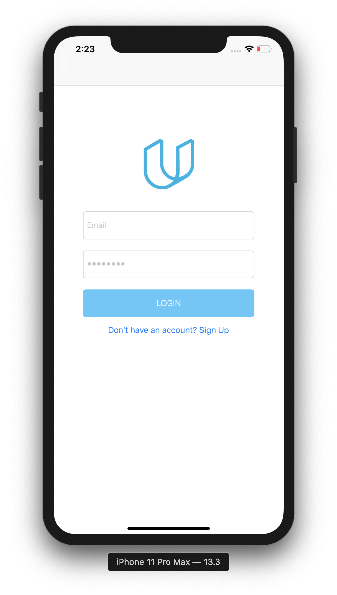
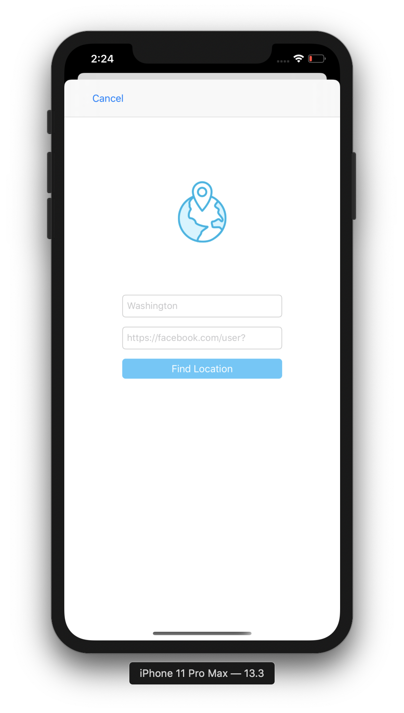
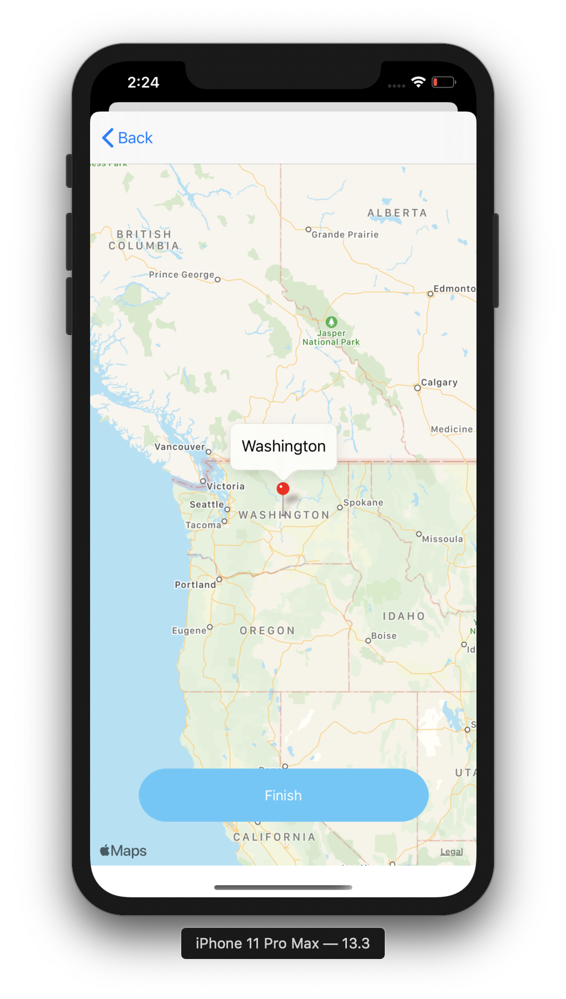

# On the Map (iOS Nanodegree)

On the Map utilizes Apple MapKit and Udacity API to give the Students the ability to preview other fellow students' information and location on the map. The map contains pins that show the location where other students have reported studying. By tapping on the pin users can see a URL for something the student finds interesting. The user will be able to add their own data by posting a string that can be geocoded to a location, and a URL.

First the user's credentials are wrapped into a "POST" request and authenticated using Udacity API, after that, a "GET" request is sent to fetch the students' data from the API. A map with the locations of students in the same classroom is displayed where each annotation pin holds a student's profile website, the data can either be displayed in a map view or in a table view. Students has the ability to add and modify their information through "POST"/"PUT" requests.

On the Map consists of 5 view controllers:

- Login View Controller:

  

- Map View Controller:

  

- Table View Controller:

  

- Add New Information View Controller:

  

- Confirm Location View Controller:

  

## Dependencies:
- Apple UIKit
- Apple MapKit
- Udacity API
